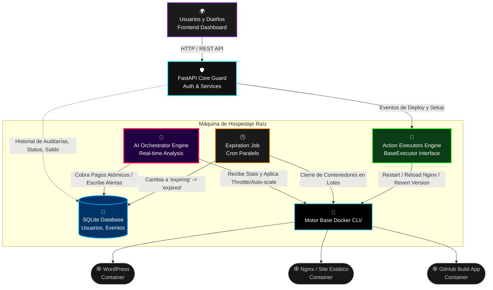

# 🛡️ Hosting Guard

## 🚀 ¿Qué es Hosting Guard?
**Hosting Guard** es una plataforma SaaS (Software as a Service) nativa para alojamiento web en la nube, impulsada por inteligencia, reactividad y ejecución autónoma profunda. 

Su función central es albergar los entornos web y proyectos de sus clientes confinando cada ecosistema en **contenedores Docker individuales**. Al mismo tiempo, el backend corre de forma persistente garantizando la facturación atómica, escalabilidad sobre la marcha y preservación monolítica y perpetua de los recursos del hardware anfitrión contra riesgos, clientes abusadores e inestabilidad global del sistema.

## 🎯 ¿Para qué sirve?
A diferencia de los paneles estáticos habituales ("cPanel"), Hosting Guard respira, reacciona y defiende tu servidor por su propia cuenta:
1. **Despliegues Automáticos Aislados**: Se emplea para lanzar (con un click) proyectos WordPress, webs estáticas o incluso extraer el código fuente puro de repositorios de GitHub al instante.
2. **Venta de "Autoscale" Inteligente**: Permite monetizar el estrés de hardware. Ante picos repentinos de popularidad de un cliente, la IA relaja dinámicamente los límites del contenedor inyectándole potencia adicional (Auto-Scaling de CPU/RAM durante 10 min) mientras le cobra micro-débitos indoloros y transparentes sin apagar los servicios.
3. **Guardia Pretoriana del Server**: Penaliza el consumo. Al detectar abusos sostenidos respecto a una suscripción (o si el *Load Average* global asfixia el servidor raíz), Hosting Guard reduce preventivamente (Throttle) o bloquea y reinicia el contenedor ofensor al vuelo.
4. **Gestión Total Free-Tier**: Sirve para administrar volúmenes masivos de planes gratuitos ofreciendo clausuras multi-hilo o advertencias programadas asincrónicas en lotes reducidos.

## 💪 Fortalezas y Características Principales
*   🧠 **Orquestador Analítico (AI Orchestrator):** Loop infinito tolerante a fallos que intercepta `docker stats` y `getloadavg`. Aplica límites progresivos (`cpu_soft`, `cpu_hard`) y penalizaciones automáticas preservando en todo instante el *Uptime* de los clientes limpios.
*   ⚖️ **Transacciones y Retrocesos Flexibles:** Utiliza transacciones seguras SQL atómicas en paralelo (deduct_balance + rollout autoscale). Si por azares del destino Docker falla, los depósitos financieros o los status se repliegan y realizan su rollback con extrema seguridad técnica y bitácoras limpias `exc_info=True`.
*   🔨 **Executor Framework Estricto**: Abstracción de protocolo orientado a objetos (`BaseExecutor`) infalible. Regula *Restart*, *Clear Cache*, y operativas de versionamiento Git en despliegues con *dry runs*, retries exponenciales adaptables y *timeouts* obligatorios de seguridad.
*   🕒 **Expiraciones Paralelizadas Limitadas:** Trabajo programado masivo donde la paginación a base de datos se limita para no agotar la memoria, mientras subprocesa a multihilo la suspensión (`docker stop`) de hosts muertos emitiendo advertencias 1 única vez al día en paralelo limitando a pooles precisos.
*   📊 **Analytics Telemetría Integrada (Pixel):** Adhesión de recolección de tráfico web a través de un simple pixel.

## 🔄 El Ciclo de Vida Ecosistémico

**1. Onboarding & Provisioning:**  
El usuario se suma libremente mediante el Auth de nuestro *User Dashboard Frontend*. Lanza la creación de un host configurando el destino y nuestra API (FastAPI) registra la suscripción generando el despliegue a su contenedor asignado y reportando a nuestra BD en SQLite.

**2. Patrulla Continua:**  
El `orchestrator.py` da vueltas recolectando síntomas base del Sistema Operativo de Hosting Guard y evaluando simultáneamente a todos los contenedores operantes que encuentra contra nuestra tabla unificada de límites transaccionales:
- ¿Requiere más CPU temporal a cambio de saldo? -> *Autoscale Event*
- ¿El servidor está en pánico e infarta en memoria RAM global? -> *Crisis Mitigation (Frenar Planes Free a costa de planes Negocios).*
- ¿Excedió su techo crítico particular? -> *Restart Container de Forzoso*.

**3. Purga Automática Temporal:**  
Las tareas automatizadas nocturnas `expiration_job.py` recolectan instancias gratuitas que superaron los 14 días. Paralelizan cierres lógicos del negocio para la BD y físicos operando los recortes contra Docker hasta vaciar los abusos de retención indebida al finalizar promociones.

---

## 🏗️ Arquitectura de la Plataforma

Un vistazo al flujo maestro del modelo, desde la orden en React hasta las bases del Motor Docker.

